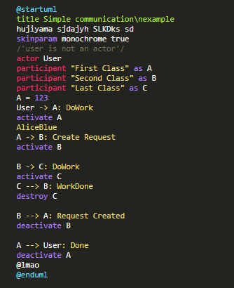

# plantuml - a language grammar for highlight.js

## Usage

Simply include the Highlight.js library in your webpage.

### Static website or simple usage

Simply load the module after loading Highlight.js.  You'll use the minified version found in the `dist` directory.  This module is just a CDN build of the language, so it will register itself as the Javascript is loaded.

```html
<script type="text/javascript" src="/path/to/highlight.min.js"></script>
<script type="text/javascript" src="/path/to/plantuml.min.js"></script>
<script type="text/javascript">
  hljs.highlightAll();
</script>
```

## Example
Here you can see how highlightjs-plantuml works:


## License

Highlight.js is released under the MIT License. See [LICENSE](https://github.com/ZlatanMLG/highlightjs-plantuml/blob/main/LICENSE) file
for details.

### Author

Valentyn Zhelepa <neokek1@gmail.com>
