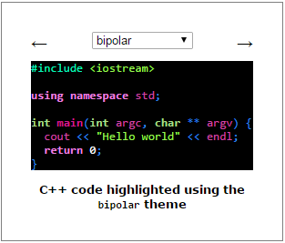
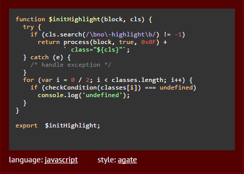

## Зміст
1. [Вступ](#вступ)
2. [Технічне завдання](#завдання)
3. [Основні положення](#теорія)
4. [Проектування](#проектування)
5. [Розробка](#розробка)
6. [Тестування](#тести)
7. [Висновки](#висновки)
8. [Джерела](#джерела)

<a name="вступ"></a>
## Вступ

**PlantUML** - це інструмент з відкритим кодом, що дозволяє користувачам створювати діаграми з простої текстової мови. Окрім різних діаграм UML, PlantUML підтримує різні інші формати, пов'язані з розробкою програмного забезпечення (такі як Archimate, Block diagram, BPMN, C4, Computer network diagram, ERD, Gantt chart, Mind map, та WBD), а також візуалізація JSON та Файли YAML.

**Highlight.js** - це хайлайтер синтаксису, написаний на JavaScript. Він працює як у браузері, так і на сервері. Він може працювати практично з будь-якою розміткою, не залежить від будь-яких інших фреймворків і має автоматичне визначення мови.

**Мета**
Метою документа є демонстрація процесу створення власного хайлайтера для обраної мови на базі бібліотеки highlight.js.

**Переваги підсвічування синтаксису**

Виділення синтаксису або розфарбовування коду пропонує наступні переваги:

**1. Візуальна привабливість**
- Читати код і розпізнавати його структуру стає простіше. Підсвічування кольором для машини не важливе, але є надзвичайно корисним для розробників. Як результат, наприклад, перегляд коду простіший (вибірково).
- У багатьох редакторах та середовищах розробки схему підсвічування можна адаптувати індивідуально, так що задоволення від розробки також збільшується.

**2. Економія часу та підвищення продуктивності**
- Впровадження коду стає простішим, оскільки виділення здійснюється в режимі реального часу і помилки друку можна виявити швидше. Наприклад, більшість редакторів виділяють рядкові літерали іншим кольором. Отже, помітити пропущений роздільник набагато простіше через контрастний колір тексту. Неправильні ключові слова також можна визначити швидше, оскільки вони не забарвлюються. Це призводить до вищої продуктивності під час розробки, тим більше, що сучасні редактори більше не страждають від втрат продуктивності через забарвлення / перетворення.
- Читач може легко ігнорувати великі розділи коментарів або коду, залежно від того, що вони шукають.
- Дослідження, опубліковане на конференції PPIG, оцінило вплив виділення синтаксису на розуміння коротких програм, виявивши, що наявність підсвічування синтаксису значно скорочує час, необхідний програмісту для узагальнення семантики програми. Окрім того, дані, зібрані під час дослідження, що відстежували очі, свідчать про те, що підсвічування синтаксису дозволяє програмістам приділяти менше уваги стандартним синтаксичним компонентам, таким як ключові слова.

**Реалізація**
Для реалізації проекту використовувались наступні технології та фреймворки:  PlantUML, Node.js(npm), highlighter.js, HTML, Mocha test. 

<a name="завдання"></a>
## Технічне завдання

**Загальне завдання**
Розробити модуль підсвічування синтаксису мови plantuml для бібліотеки highlight.js.

**Функціональність**
- Користувач повинен мати можливість використовувати створений хайлайтер на власній машині.

<a name="теорія"></a>
## Основні положення
### Поняття підвічування синтаксису, приклади хайлайтерів та їх використання

**Підсвічування синтаксису** - це особливість текстових редакторів, які використовуються для програмування, сценаріїв або мов розмітки, таких як HTML. Функція відображає текст, особливо вихідний код, різними кольорами та шрифтами відповідно до категорії термінів.

Вони ~~зовсім непотрібні~~ корисні для тих, хто любить програмувати. Поки ви пишете код, вам може знадобитися такий собі плагін, щоб виділити будь-який приклад коду на вашому веб-сайті або ж блозі. Наступна колекція плагінів для виділення синтаксису містить лише ті, які пропонують найкращі функції, просту ініціалізацію та стилі. Жоден з них не вимагає роботи jQuery, оскільки вони незалежні і використовують лише VanillaJS.

## SHJS

SHJS - це скрипт JavaScript, який виділяє фрагменти вихідного коду в документах HTML. Документи, що використовують SHJS, виділяються на стороні клієнта веб-браузером.
SHJS використовує визначення мов з GNU Source-highlight. Це дає SHJS можливість виділити вихідний код, написаний багатьма різними мовами. SHJS повинен працювати в будь-якому браузері, який відповідає стандартам HTML 4, ECMA-262 та DOM Level 2.

Щоб використовувати SHJS, потрібно принаймні 3 файли:

  * Основний скрипт або зменшена версія
  * Файл визначення мови
  * Таблиця стилів

Цей плагін є доволі олдскульним, тому вам потрібно завантажити .js-файл із визначенням мови, яку ви хочете виділити. Однак ви можете охопити їх усі в одному файлі.



## SyntaxHighlighter

SyntaxHighlighter - це повністю функціональний автономний, підсвічувач синтаксису коду на стороні клієнта з відкритим кодом, розроблений у JavaScript.

Щоб SyntaxHighlighter працював на вашій сторінці, вам потрібно зробити наступне:

  * Дотримуючись інструкцій з побудови, щоб зібрати власний syntaxhighlighter.js, опустіть його на сторінку за допомогою 
  ```html 
  <script src="syntaxhighlighter.js" />
  ``` 
  тегу, або дотримуйтесь інструкцій щодо використання CommonJS.

Для ініціалізації коду javascript можна використовувати:

```html
<script type="text/javascript" src="syntaxhighlighter.js"></script>

<pre class="brush: js">
function foo()
{
}
</pre>
```

На жаль, SyntaxHighlighter не підтримує жодного стандарту, тому ваша розмітка буде виділена цим плагіном і не настільки підтримувана.

## Rainbow

Rainbow - це бібліотека для виділення синтаксису коду, написана на Javascript. Вона була розроблена для того, щоб бути компактною (1,4 кб), простою у користуванні та розширюваною. Вона повністю стилізується за допомогою CSS. Rainbow сама по собі дуже проста. Вона проходить через блоки коду, обробляє шаблони регулярних виразів і охоплює відповідні шаблони в теги <span>. Уся стилізація залишаються за CSS.

У вашій розмітці атрибут мови даних використовується, щоб вказати, яку мову використовувати для виділення:

```html
<pre><code data-language="javascript">var testing = true;</code></pre>
```


Використовуйте метод Rainbow.color, щоб виділити код:

```javascript
Rainbow.color();
```

## Highlight.js

Нарешті, highlight.js - це супер DOM хайлайтер. Він намагається виявити мову автоматично. Якщо автоматичне виявлення не працює для вас, ви можете вказати мову в атрибуті класу:

  * [152 languages and 72 styles](https://highlightjs.org/static/demo/)
  * automatic language detection
  * multi-language code highlighting
  * available for node.js
  * works with any markup
  * compatible with any js framework

Щоб використовувати highlight.js у своєму проекті, просто включіть файли CSS та JS та ініціалізуйте за допомогою:

```javascript
initHighlightingOnLoad()
```
Метод:

```html
<!-- Include library -->
<link rel="stylesheet" href="/path/to/styles/default.css">
<script src="/path/to/highlight.pack.js"></script>
<!-- Initialize highlight -->
<script>hljs.initHighlightingOnLoad();</script>
```

Необхідна розмітка повинна виглядати так:

```html
<pre><code class="html">Sample 2021 code for the bois</code></pre>
```



<!-- ### Дослідження існуючих програмних продуктів

|   | Zoho Sprint | Wrike | Confluence | Meister Task | TeamworkProjects | Easy Projects | Paymo | Quire | Talk on Task | Zenkit | Trello | Smartsheet | Mavenlink | Avaza | Monday.com | JIRA | ProWorkflow | Asana |
| --- | --- | --- | --- | --- | --- | --- | --- | --- | --- | --- | --- | --- | --- | --- | --- | --- | --- | --- |
| API | + | + | + |   | + |   |   |   |   |   | + | + | + |   | + | + |   |   |
| Безпека даних | + | + | + | + | + | + |   | + |   |   | + |   |   | + |   |   | + |   |
| Теги |   |   |   | + | + |   |   |   |   |   |   |   |   | + | + |   |   |   |
| Бесіди / чати |   |   |   |   |   |   | + | + | + |   |   |   |   |   |   |   |   | + |
| Мобільний додаток |   | + |   |   |   |   | + |   |   |   |   |   |   |   |   |   | + |   |
| Контроль версій |   | + |   |   | + |   |   |   |   |   |   |   |   |   |   | + |   |   |
| Шаблони проектів |   | + |   |   | + | + | + |   |   |   |   |   | + | + |   |   | + | + |
| Наявність метрик | + | + | + | + | + |   |   |   | + | + | + | + | + | + | + | + | + | + |
| Управлння завданнями | + | + |   |   | + |   | + |   | + | + |   | + | + | + |   |   | + | + |
| Спільне робоче поле |   | + | + | + |   |   |   | + |   |   |   |   | + |   |   |   | + |   |
| Управління артефактами | + | + |   | + |   | + | + |   |   |   | + | + | + | + |   | + | + | + |
| Підтримка кількох проектів |   |   |   |   |   |   |   |   |   |   |   | + | + |   |   |   |   |   |
| Підтримка різних методологій |   |   |   |   |   |   |   |   |   |   |   |   |   | + |   |   | + |   |
 -->
<a name="проектування"></a>
## Проектування
<!-- **Діаграма юзкейсів**

 -->

**Сценарій підсвітки тексту типу string**

| Ідентифікатор: | STRING |
| --- | --- |
| Назва: | Підсвітка тексту типу string |
| Учасники: | Користувач; Система |
| Передумови: | Користувач використав елементи виділенні лапками ' ' |
| Результат: | Користувач отримує певну підсвітку синтаксису |
| Виключні ситуації: | Текст є частиною іншого класу, наприклад - заголовку |
| Основний сценарій: | 1. Користувач використовує текст виділений лапками.<br>2. Система ідентифікує даний текст окремим класом.<br>3. Система підсвічує даний текст певним кольором.<br>4. Користувач отримує певну підсвітку синтаксису.|

**Сценарій підсвітки коментарів**

| Ідентифікатор: | COMMENT |
| --- | --- |
| Назва: | Підсвітка коментарів. |
| Участники: | Користувач; Система |
| Передумови: | Користувач вирішив зареєструватись в системі |
| Результат: | Створення нового облікового запису користувача |
| Основний сценарій: |  1. Користувач натискає кнопку[Реєстрація].<br>2. Система пропонує форму &quot;Реєстрація нового користувача&quot;.<br>3. Користувач заповнює поля:логін,email, пароль, ім'я, прізвище.<br>4. Користувач підтверджує правильність введених даних.<br>5. Система перевіряє введені дані.<br>6. До бази даних додається новий запис користувача. |
| Виключні ситуації: | Переривання реєстрації, введення неправильних та повторних даних |

<!-- ### Діаграми послідовностей

**Діаграма V-INFO**


=======
**Діаграма RG-1**


 
**Діаграма LG**


 
**Діаграма PRJ-V**


**Діаграма N-PRJ**


**Діаграма ADD-ARTF**


**Діаграма ED-ARTF**


**Діаграма ADD-CON**


**Діаграма RM-CON**


**Діаграма ADD-TSK**


**Діаграма DEL-PRJ**

 -->


<a name="розробка"></a>
## Розробка

<!-- 


 -->
<a name="тести"></a>
## Тестування

<a name="висновки"></a>
## Висновки

<a name="джерела"></a>
## Джерела

1. https://developer.mozilla.org/ru/docs/Web/JavaScript/Guide/Regular_Expressions
2. https://highlightjs.readthedocs.io/en/latest/language-guide.html
3. https://en.wikipedia.org/wiki/Syntax_highlighting
4. https://github.com/highlightjs/highlight.js
5. https://github.com/highlightjs/highlightjs-cypher
6. https://github.com/highlightjs/highlight.js/blob/main/extra/3RD_PARTY_QUICK_START.md
7. https://mochajs.org/
8. https://highlightjs.org/
