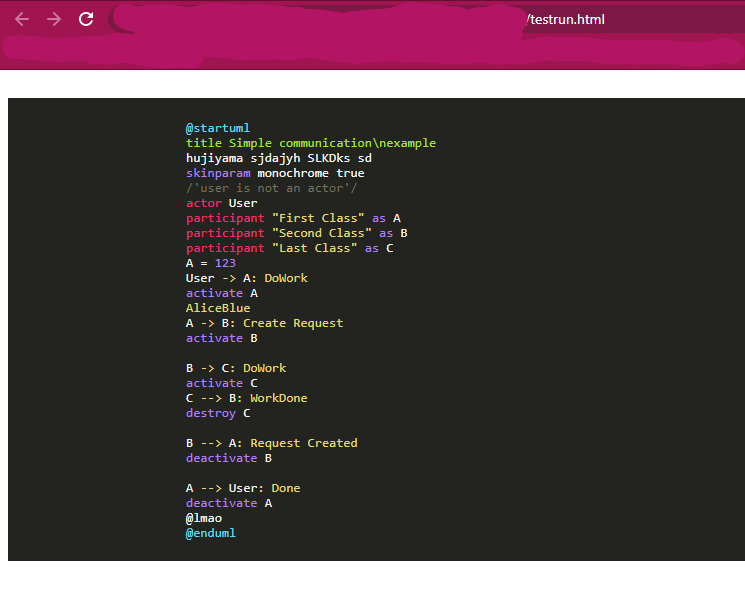
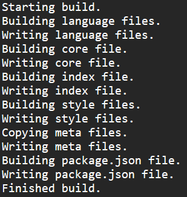

## Зміст
1. [Вступ](#вступ)
2. [Технічне завдання](#завдання)
3. [Основні положення](#теорія)
4. [Проектування](#проектування)
5. [Розробка](#розробка)
6. [Тестування](#тести)
7. [Висновки](#висновки)
8. [Джерела](#джерела)

<a name="вступ"></a>
## Вступ

**PlantUML** - це інструмент з відкритим кодом, що дозволяє користувачам створювати діаграми з простої текстової мови. Окрім різних діаграм UML, PlantUML підтримує різні інші формати, пов'язані з розробкою програмного забезпечення (такі як Archimate, Block diagram, BPMN, C4, Computer network diagram, ERD, Gantt chart, Mind map, та WBD), а також візуалізація JSON та Файли YAML.

**Highlight.js** - це хайлайтер синтаксису, написаний на JavaScript. Він працює як у браузері, так і на сервері. Він може працювати практично з будь-якою розміткою, не залежить від будь-яких інших фреймворків і має автоматичне визначення мови.

**Мета**
Метою документа є демонстрація процесу створення власного хайлайтера для обраної мови на базі бібліотеки highlight.js.

**Переваги підсвічування синтаксису**

Виділення синтаксису або розфарбовування коду пропонує наступні переваги:

**1. Візуальна привабливість**
- Читати код і розпізнавати його структуру стає простіше. Підсвічування кольором для машини не важливе, але є надзвичайно корисним для розробників. Як результат, наприклад, перегляд коду простіший (вибірково).
- У багатьох редакторах та середовищах розробки схему підсвічування можна адаптувати індивідуально, так що задоволення від розробки також збільшується.

**2. Економія часу та підвищення продуктивності**
- Впровадження коду стає простішим, оскільки виділення здійснюється в режимі реального часу і помилки друку можна виявити швидше. Наприклад, більшість редакторів виділяють рядкові літерали іншим кольором. Отже, помітити пропущений роздільник набагато простіше через контрастний колір тексту. Неправильні ключові слова також можна визначити швидше, оскільки вони не забарвлюються. Це призводить до вищої продуктивності під час розробки, тим більше, що сучасні редактори більше не страждають від втрат продуктивності через забарвлення / перетворення.
- Читач може легко ігнорувати великі розділи коментарів або коду, залежно від того, що вони шукають.
- Дослідження, опубліковане на конференції PPIG, оцінило вплив виділення синтаксису на розуміння коротких програм, виявивши, що наявність підсвічування синтаксису значно скорочує час, необхідний програмісту для узагальнення семантики програми. Окрім того, дані, зібрані під час дослідження, що відстежували очі, свідчать про те, що підсвічування синтаксису дозволяє програмістам приділяти менше уваги стандартним синтаксичним компонентам, таким як ключові слова.

**Реалізація**

Для реалізації проекту використовувались наступні технології та фреймворки:  PlantUML, Node.js(npm), highlighter.js, HTML, Mocha test. 

<a name="завдання"></a>
## Технічне завдання

**Загальне завдання**

Розробити модуль підсвічування синтаксису мови plantuml для бібліотеки highlight.js.

**Функціональність**
- Користувач повинен мати можливість використовувати створений хайлайтер на власній машині.

<a name="теорія"></a>
## Основні положення
### Поняття підcвічування синтаксису, приклади хайлайтерів та їх використання

**Підсвічування синтаксису** - це особливість текстових редакторів, які використовуються для програмування, сценаріїв або мов розмітки, таких як HTML. Функція відображає текст, особливо вихідний код, різними кольорами та шрифтами відповідно до категорії термінів.

Вони ~~зовсім непотрібні~~ корисні для тих, хто любить програмувати. Поки ви пишете код, вам може знадобитися такий собі плагін, щоб виділити будь-який приклад коду на вашому веб-сайті або ж блозі. Наступна колекція плагінів для виділення синтаксису містить лише ті, які пропонують найкращі функції, просту ініціалізацію та стилі. Жоден з них не вимагає роботи jQuery, оскільки вони незалежні і використовують лише VanillaJS.

## SHJS

SHJS - це скрипт JavaScript, який виділяє фрагменти вихідного коду в документах HTML. Документи, що використовують SHJS, виділяються на стороні клієнта веб-браузером.
SHJS використовує визначення мов з GNU Source-highlight. Це дає SHJS можливість виділити вихідний код, написаний багатьма різними мовами. SHJS повинен працювати в будь-якому браузері, який відповідає стандартам HTML 4, ECMA-262 та DOM Level 2.

Щоб використовувати SHJS, потрібно принаймні 3 файли:

  * Основний скрипт або зменшена версія
  * Файл визначення мови
  * Таблиця стилів

Цей плагін є доволі олдскульним, тому вам потрібно завантажити .js-файл із визначенням мови, яку ви хочете виділити. Однак ви можете охопити їх усі в одному файлі.


## SyntaxHighlighter

SyntaxHighlighter - це повністю функціональний автономний, підсвічувач синтаксису коду на стороні клієнта з відкритим кодом, розроблений у JavaScript.

Щоб SyntaxHighlighter працював на вашій сторінці, вам потрібно зробити наступне:

  * Дотримуючись інструкцій з побудови, щоб зібрати власний syntaxhighlighter.js, опустіть його на сторінку за допомогою 
  ```html 
  <script src="syntaxhighlighter.js" />
  ``` 
  тегу, або дотримуйтесь інструкцій щодо використання CommonJS.

Для ініціалізації коду javascript можна використовувати:

```html
<script type="text/javascript" src="syntaxhighlighter.js"></script>

<pre class="brush: js">
function foo()
{
}
</pre>
```

На жаль, SyntaxHighlighter не підтримує жодного стандарту, тому ваша розмітка буде виділена цим плагіном і не настільки підтримувана.

## Rainbow

Rainbow - це бібліотека для виділення синтаксису коду, написана на Javascript. Вона була розроблена для того, щоб бути компактною (1,4 кб), простою у користуванні та розширюваною. Вона повністю стилізується за допомогою CSS. Rainbow сама по собі дуже проста. Вона проходить через блоки коду, обробляє шаблони регулярних виразів і охоплює відповідні шаблони в теги <span>. Уся стилізація залишаються за CSS.

У вашій розмітці атрибут мови даних використовується, щоб вказати, яку мову використовувати для виділення:

```html
<pre><code data-language="javascript">var testing = true;</code></pre>
```


Використовуйте метод Rainbow.color, щоб виділити код:

```javascript
Rainbow.color();
```

## Highlight.js

Нарешті, highlight.js - це супер DOM хайлайтер. Він намагається виявити мову автоматично. Якщо автоматичне виявлення не працює для вас, ви можете вказати мову в атрибуті класу:

  * [152 languages and 72 styles](https://highlightjs.org/static/demo/)
  * automatic language detection
  * multi-language code highlighting
  * available for node.js
  * works with any markup
  * compatible with any js framework

Щоб використовувати highlight.js у своєму проекті, просто включіть файли CSS та JS та ініціалізуйте за допомогою:

```javascript
initHighlightingOnLoad()
```
Метод:

```html
<!-- Include library -->
<link rel="stylesheet" href="/path/to/styles/default.css">
<script src="/path/to/highlight.pack.js"></script>
<!-- Initialize highlight -->
<script>hljs.initHighlightingOnLoad();</script>
```

Необхідна розмітка повинна виглядати так:

```html
<pre><code class="html">Sample 2021 code for the bois</code></pre>
```


<!-- ### Дослідження існуючих програмних продуктів

|   | Zoho Sprint | Wrike | Confluence | Meister Task | TeamworkProjects | Easy Projects | Paymo | Quire | Talk on Task | Zenkit | Trello | Smartsheet | Mavenlink | Avaza | Monday.com | JIRA | ProWorkflow | Asana |
| --- | --- | --- | --- | --- | --- | --- | --- | --- | --- | --- | --- | --- | --- | --- | --- | --- | --- | --- |
| API | + | + | + |   | + |   |   |   |   |   | + | + | + |   | + | + |   |   |
| Безпека даних | + | + | + | + | + | + |   | + |   |   | + |   |   | + |   |   | + |   |
| Теги |   |   |   | + | + |   |   |   |   |   |   |   |   | + | + |   |   |   |
| Бесіди / чати |   |   |   |   |   |   | + | + | + |   |   |   |   |   |   |   |   | + |
| Мобільний додаток |   | + |   |   |   |   | + |   |   |   |   |   |   |   |   |   | + |   |
| Контроль версій |   | + |   |   | + |   |   |   |   |   |   |   |   |   |   | + |   |   |
| Шаблони проектів |   | + |   |   | + | + | + |   |   |   |   |   | + | + |   |   | + | + |
| Наявність метрик | + | + | + | + | + |   |   |   | + | + | + | + | + | + | + | + | + | + |
| Управлння завданнями | + | + |   |   | + |   | + |   | + | + |   | + | + | + |   |   | + | + |
| Спільне робоче поле |   | + | + | + |   |   |   | + |   |   |   |   | + |   |   |   | + |   |
| Управління артефактами | + | + |   | + |   | + | + |   |   |   | + | + | + | + |   | + | + | + |
| Підтримка кількох проектів |   |   |   |   |   |   |   |   |   |   |   | + | + |   |   |   |   |   |
| Підтримка різних методологій |   |   |   |   |   |   |   |   |   |   |   |   |   | + |   |   | + |   |
 -->
<a name="проектування"></a>
## Проектування
<!-- **Діаграма юзкейсів**

 -->

**Сценарій підсвітки тексту типу string**

| Ідентифікатор: | STRING |
| --- | --- |
| Назва: | Підсвітка тексту типу string |
| Учасники: | Користувач; Система |
| Передумови: | Користувач використав елементи виділенні лапками ' ' |
| Результат: | Користувач отримує певну підсвітку синтаксису |
| Виключні ситуації: | Текст є частиною іншого класу, наприклад - заголовку або ж коментару |
| Основний сценарій: | 1. Користувач використовує текст виділений лапками.<br>2. Система ідентифікує даний текст окремим класом.<br>3. Система підсвічує даний текст певним кольором.<br>4. Користувач отримує певну підсвітку синтаксису.|

**Сценарій підсвітки коментарів**

| Ідентифікатор: | COMMENT |
| --- | --- |
| Назва: | Підсвітка коментарів. |
| Участники: | Користувач; Система |
| Передумови: | Користувач використав елементи виділенні данним чином: /' '/ |
| Результат: | Користувач отримує певну підсвітку синтаксису |
| Основний сценарій: |  1. Користувач вписав текст усередині /' '/.<br>2. Система ідентифікує даний текст окремим класом.<br>3. Система підсвічує даний текст певним кольором.<br>4. Користувач отримує певну підсвітку синтаксису.|

**Сценарій підсвітки границь коду**

| Ідентифікатор: | SYMBOL |
| --- | --- |
| Назва: | Підсвітка границь коду. |
| Участники: | Користувач; Система |
| Передумови: | Користувач використав '@startuml' або ж '@enduml' |
| Результат: | Користувач отримує певну підсвітку синтаксису |
| Основний сценарій: |  1. Користувач використав @startuml або ж @enduml.<br>2. Система ідентифікує даний текст окремим класом.<br>3. Система підсвічує даний текст певним кольором.<br>4. Користувач отримує певну підсвітку синтаксису.|

**Сценарій підсвітки назви заголовку**

| Ідентифікатор: | TITLE |
| --- | --- |
| Назва: | Підсвітка заголовку. |
| Участники: | Користувач; Система |
| Передумови: | Користувач використав 'title' |
| Результат: | Користувач отримує певну підсвітку синтаксису |
| Виключні ситуації: | title знаходиться в середині коментаря, або ж є 'string' класом |
| Основний сценарій: |  1. Користувач використав 'title'.<br>2. Система ідентифікує даний текст окремим класом.<br>3. Система підсвічує даний текст певним кольором.<br>4. Користувач отримує певну підсвітку синтаксису.|

<a name="розробка"></a>
## Розробка

Розробка та створення власного хайлайтера починається з розуміння його завдання, структури та базового синтаксису.
Для початку потрібно розуміти, що мова програмування, для якої ви будете створювати хайлайтер, складається з різних частин, кожна з яких буде мати власний синтаксичний аналіз - а відповідно і власне підсвічування. Такими частинами у більшості мов програмування виступають: 
	* ключові слова
	* коментари
	* функції або ж процедури
	* розділові знаки
	* класи та типи об'єктів та безліч інших складових коду

Але варто пам'ятати, що ті ж самі знайомі нам ключові слова `for` та `if`  не мають сенсу всередині рядкових форматів, які у свою чергу можуть містити зворотню косу риску `\`, що у багатьох мовах програмування вважається початком коментару, а коментарі зазвичай не містять нічого цікавого, окрім закінчення самого ж коментару.

У Highlight.js такі частини називаються "режимами".

Кожен режим підсвітки може складатися з:
	* умови початку
	* умови закінчення
	* списку вміщених підрежимів
	* правил, регулярних виразів та ключових слів
	* інколи може містити деяку мову всередині іншої мови

Надалі розглядатимемо загальну структуру хайлайтеру highlight.js та її найважливіші складові:
```javascript
{
  case_insensitive: true, // чутливість до регістру
  keywords: 'for if while',
  contains: [
    {
      className: 'string',
      begin: '"', end: '"'
    },
    hljs.COMMENT(
      '/\\*', // умова початку
      '\\*/', // умова кінця
      {
        contains: [
          {
            className: 'doc', begin: '@\\w+'
          }
        ]
      }
    )
  ]
}
```
### Ключові слова (Keywords)

У загальному випадку ключове слово – це засіб мови програмування, який:
	* вбудований в мову програмування
	* використовується для розробки програми на цій мові
Кожна з мов програмування має як спільні з іншими мовами, так і власні `keywords`. 

Водночас, деякі мови мають різні типи "ключових слів", які з огляду синтаксичного аналізу хоч і не є однаковими, але є дуже близькими один до одного з точки зору підсвічування синтаксису. Це всілякі `literals`, `built-in`, `symbols` тощо. Щоб визначити такі групи ключових слів, ключові слова атрибутів стають об’єктом, кожна властивість якого визначає власну групу ключових слів:
```javascript
{
  keywords: {
    keyword: 'else for if while', //Перший спосіб задання списку ключових слів - перелік у лапках через пробіл 
    literal: ['false','true','null'], //Другий спосіб - масивом.
    _relevance_only: 'one two three four'
  }
}
```

### Генерація підсвітки

Важливо розуміти, що яким кольором буде підсвічуватись текст, назви класів та їх графічні складові визначає `css` стиль, а не модуль підсвічування тексту для бібліотеки highlight.js, який ми створюємо. У цьому проекті не розглядається його створення, а для візуального тестування використовується вже існуючий - `monokai`. Плід наших зусиль являє собою деяку "підсказку", "вказування шляху та границь підсвічування", а не задання палітри підсвітки. 

Режими хайлайтеру зазвичай генерують фактичну розмітку виділення - елементи `<span>` з певними іменами класів, які визначаються атрибутом `className`:
```javascript
{
className:"symbol",
begin: /\@startuml|\@enduml/,
end: "\n"
}
```

Надзвичайно важливим, я б навіть сказав життєво-необхідним у нашій роботі є знання регулярних виразів, їх розуміння та вміння вільно ними користуватися. Саме регулярними виразами ми будемо задавати умови початку та кінця підсвічування синтаксису.
Чудовими сайтами для їх вивчення та тренування відповідно є: [MND Web Docs](https://developer.mozilla.org/en-US/docs/Web/JavaScript/Guide/Regular_Expressions) та [Regexr](https://regexr.com/)

Давайте розглянемо регулярні вирази у наведеному вище прикладі:
Завдання данного класу - виділення "@startuml" і "@enduml" унікальним чином. Така необхідність з'являється, оскільки жодна програма мовою `plantuml` не може обійтись без них, та саме вони є границями нашої програми.
 `/\@startuml|\@enduml/` - умова початку. Задаючи умову початку у передніх косих рисах, ми говоримо, що весь синтаксис всередині умови має йти поспіль. Елемент `@` потрібно попередньо екранувати за допомогою бекслешу, бо інакше цей елемент не буде вважатись одним цілим з словами, що слідують за ним. Вертикальна ж риса `|` позначатиме логічну дію 'OR', тобто 'або'. 
 Умовою кінця виступає новий рядок, що позначається спецсимволом `\n`.

 Перекладаючи на людську мову, дана частина коду звучить як: "Якщо текст починається з '@startuml' або ж '@enduml', та закінчується новим рядком, то присвоїти тексту клас 'symbol'(і відповідну задану в css цьому класу підсвітку)."  

<a name="тести"></a>
## Тестування

Звичайно, кожна робота потребує належного тестування, інакше в реальному житті, неважливо чи це офіційне працевлаштування, чи курсова робота для університету, у вас її ніхто не прийме. 
Для тестування хайлайтеру на початку доволі зручно використовувати веб-сторінку на локальному хості, до якої попередньо необхідно підключити ваш хайлайтер та бажаний css клас.
Просто завантажте модуль після завантаження Highlight.js. Ви будете використовувати зменшену версію, знайдену в каталозі dist. Цей модуль - це просто побудова мови CDN, тому він зареєструється під час завантаження Javascript.
Підключення highlight.js та вашого хайлайтеру:
```html
<script type="text/javascript" src="/path/to/highlight.min.js"></script>
<script type="text/javascript" src="/path/to/plantuml.min.js"></script>
<script type="text/javascript">
  hljs.highlightAll();
</script>
```
Підключення css стилю:
```html
<link rel="stylesheet" href="https://cdnjs.cloudflare.com/ajax/libs/highlight.js/10.6.0/styles/monokai-sublime.min.css">
```

Плюсом такого тестуванню є суб'єктивна оцінка роботи вашого модуля підсвітки у режимі реального часу, та легкість його створення. Мною під час розробки проекту використано веб-сторінку з даним кодом:
```html
<!DOCTYPE html>
<html lang="en">

<head>
	<meta charset="utf-8">
	<link rel="stylesheet" href="https://cdnjs.cloudflare.com/ajax/libs/highlight.js/10.6.0/styles/monokai-sublime.min.css">
	<title>Test</title>
</head>
<body>

	<pre>
		<code class="plantuml">
			@startuml
			title Simple communication\nexample
			hujiyama sjdajyh SLKDks sd
			skinparam monochrome true
			/'user is not an actor'/
			actor User
			participant "First Class" as A
			participant "Second Class" as B
			participant "Last Class" as C
			A = 123
			User -> A: DoWork
			activate A
			AliceBlue
			A -> B: Create Request
			activate B

			B -> C: DoWork
			activate C
			C --> B: WorkDone
			destroy C

			B --> A: Request Created
			deactivate B

			A --> User: Done
			deactivate A
			@lmao
			@enduml
		</code>
	</pre>
	<script type="text/javascript" src="https://cdnjs.cloudflare.com/ajax/libs/highlight.js/10.6.0/highlight.min.js"></script>
	<script type="text/javascript" src="C:\Users\neoke\OneDrive\Рабочий стол\plantuml\ffff.min.js"></script>
	<script type="text/javascript">hljs.highlightAll();</script>


</body>
</html>
```

Для відображення результату роботи модуля підсвітки достатньо запустити дану сторінку:


Звичайно, назвати якісним таке тестування неможливо, тож для більш конструктивного та доречного користування мною було використано стандартні для бібліотеки highlight.js тести, попередньо змінені для їх правильної роботи.
Для такого тестування попередньо необхідно завантажити `Node.js` на вашу комп'ютерну систему. Перевірити ж чи завантажений Node.js та npm можливо у консолі за допомогою команд: 
```
node -v
npm -v
```
Важливо зазначити, що стандартне тестування модулів бібліотеки highlight.js відбувається за допомогою [Mocha test](https://mochajs.org/). Тестування починається з завантаження до вашого каталогу проекту `npm` відповідною командою:
```
npm i
```
Надалі необхідно побудувати середовище тестування:
```
node tools/build.js -n plantuml -t node
```
У результаті отримаємо щось, схоже на це: 


Залишилось тільки запустити тестування командою:
```
npm test
```

Результат проходження тестів буде відображено відповідно заданій черзі:

<a name="висновки"></a>
## Висновки

<a name="джерела"></a>
## Джерела

1. https://developer.mozilla.org/ru/docs/Web/JavaScript/Guide/Regular_Expressions
2. https://highlightjs.readthedocs.io/en/latest/language-guide.html
3. https://en.wikipedia.org/wiki/Syntax_highlighting
4. https://github.com/highlightjs/highlight.js
5. https://github.com/highlightjs/highlightjs-cypher
6. https://github.com/highlightjs/highlight.js/blob/main/extra/3RD_PARTY_QUICK_START.md
7. https://mochajs.org/
8. https://highlightjs.org/
